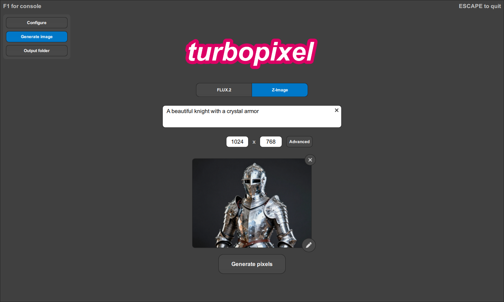

---

turbopixel is a [Sky-runtime](https://omega.gg/Sky-runtime) image generator that runs locally using
state-of-the-art generative models. It aims to provide efficient and accessible image generation
while operating entirely offline with no censorship, tracking or data collection. It is optimized to
run on modern laptops - with or without a dedicated GPU - delivering high-quality results while
maintaining reasonable generation speeds.

- [Bash scripts](bash/README.md)
