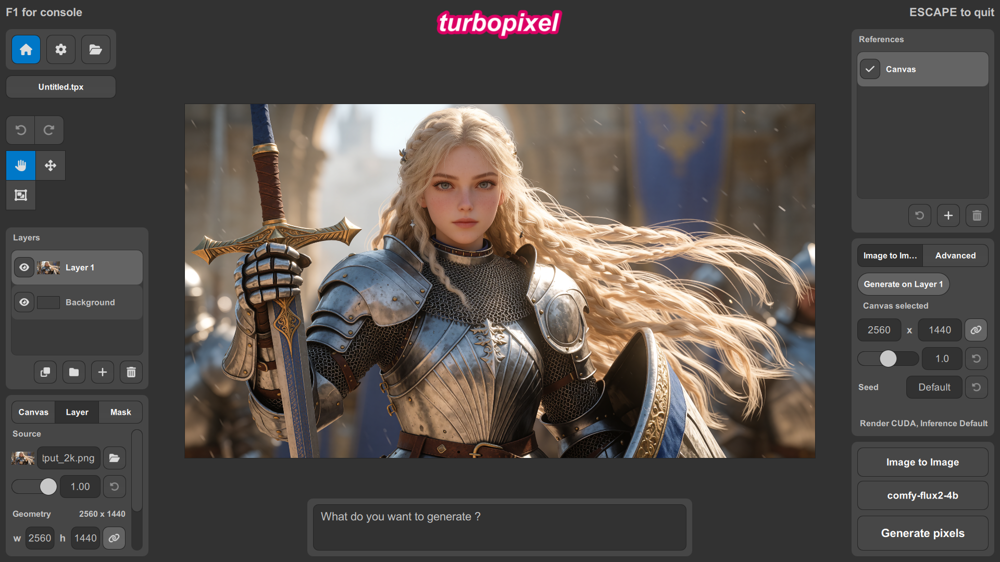

---

turbopixel is a [Sky-runtime](https://omega.gg/Sky-runtime) generative image compositor that runs
locally using state-of-the-art models. It aims to provide efficient generation and accessible image
composition while operating entirely offline with no censorship, tracking or data collection. There
is no brush or pixel editing: a picture is built out of generated layers, their masks, opacity and
the order they are stacked in. It is optimized to run on modern laptops - with or without a
dedicated GPU - delivering high-quality results while maintaining reasonable generation speeds.

- [User manual](MANUAL.md)
- [Bash scripts](bash/README.md)

## License

Copyright (C) 2025-2026 turbopixel authors | https://omega.gg/turbopixel

Licensed under the PolyForm Strict License 1.0.0 | [LICENSE.md](LICENSE.md)

This is source-available software. You can use it, read the code, and modify it for your own
purposes. Please don't redistribute it publicly (GitHub, package registries, file-sharing sites)
or resell it.

For commercial licensing inquiries: contact@omega.gg

### Authors

- Benjamin Arnaud aka [bunjee](https://bunjee.me) | <bunjee@omega.gg>
